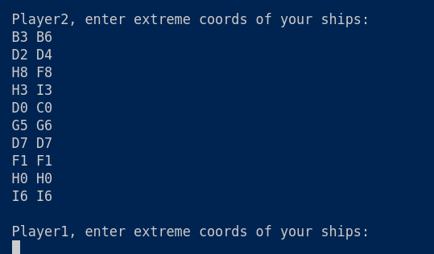
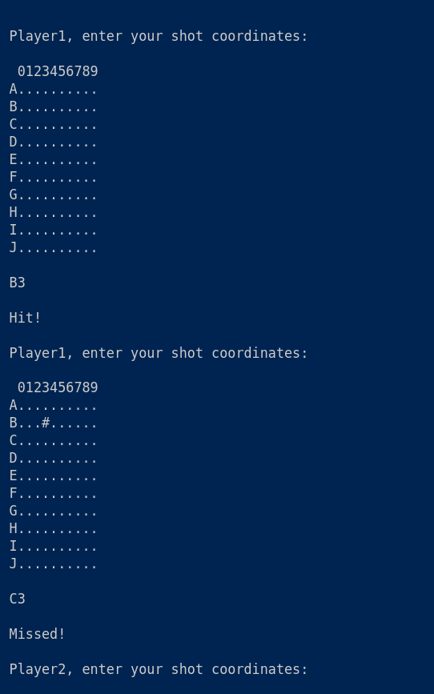

# MyBattleShip

## Run locally

### Clone project

```bash
  git clone ...
```

### Go to the project directory

```bash
  cd battle_ship
```

### Build project

```bash
  ./build.sh
```
### Run project

```bash
  ./run.sh
```

## Game instructions

### General

Two players play on fields 10 by 10.

Every player has 10 ships: one length of 4 cells, two length of 3 cells, three length of 2 cells and four length of 1 cell.

### Players' initialization



Each player should enter extreme coords of their ships.

You can find an example in file "ExampleShipCoords.txt".

### Game process



Players make shots by entering cell coords.

They always get some information about present move.

'.' indicates unknown sea cell.

'*' indicates smashed empty cell.

'#' indicates smashed ship cell.

## About project implementation

In directory "game_library" you can find the whole implementation of the project. 

Classes "PlayerInterface" and "FormatParser" describe the process of interaction with user.

They can be replaced in order to change game interface.

Other classes describe the internal logic of the game.

You can find UML diagram of the project in file "UML.png".
